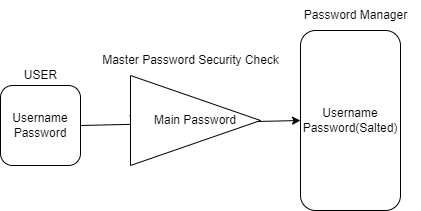
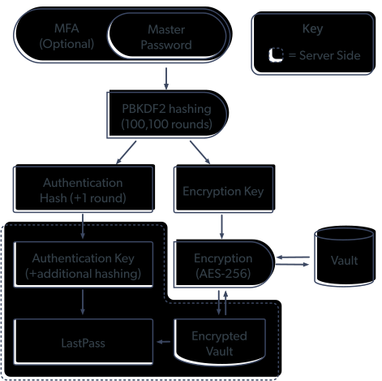
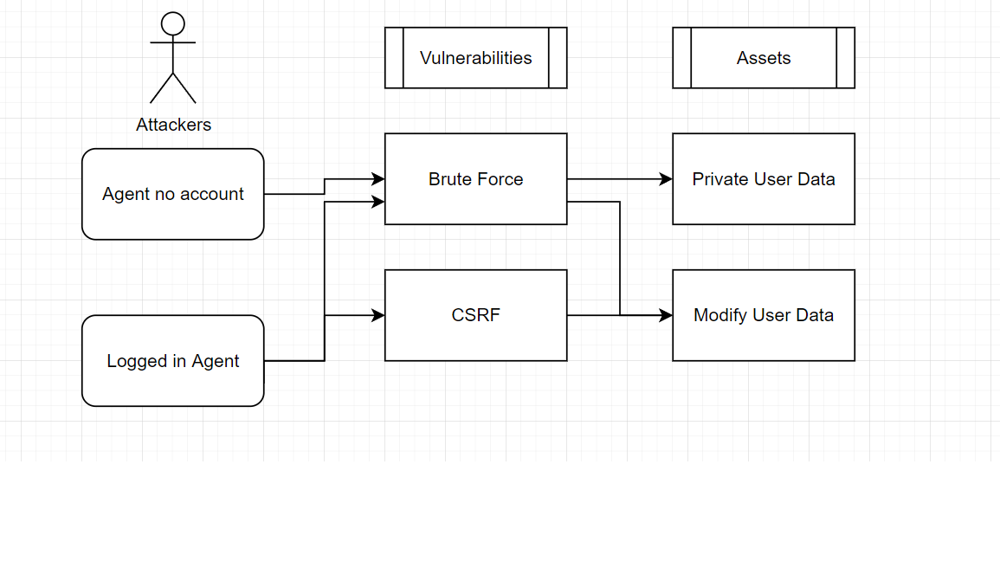

# Code-Security
## This repo contains a React Password Manager and a Note taking Web Project

## Password Manager

#### How to use
navigate to the password manager directory and inside both client and server directories run "npm install" to install dependencies needed

### Project Description
This is a Password Manager written with React to allow a user to input their password for any app/website/program etc.. and then store these password for safe keeping until the user wants to access them at a later date 

It is using "crypto" with 256-bit AES to encrypt and decrypt the users password data so as to not store them in plaintext in the local mysql database




### Example of Industry Password Manager
The idea for the project came from browsing how marketed password managers operate, my greatest example I used was from LastPass here is how they display their threat model



LastPass uses both encryption and hashing to secure user data. The user's master password is hashed using a one-way salted hashing algorithm before being transmitted and stored on LastPass's servers. Once stored, user data is encrypted using 256-bit AES encryption, both in transit and at rest, which ensures that the data cannot be accessed or read by anyone without the decryption key.

## NoteTaking

A simple note taking application designed for understanding database models, security, and web development

Built using flask

To run all is needed is to clone this repository
make sure python is installed

```sh
python main.py
```

## SECURITY checks in place

    Stateless cookie user authentication, using the flask_login module. HTTP Cookie based credentials only was picked for this over a local storage to help prevent session hijacking

    There are several threats that can happen when using this method of auth, it does leave issues and risk of Cross-site Request Forgery(CSRF), this is when a malicious agent is able to take the stored data from a registered user by imitatiating what appears to be an http request from a legit site.

    Sql-injection is protected through use of sqlalchemy. By using Sqlalchemy quoting systems escapes special characters (ie semicolons) are escaped automatically which helps prevent sql injections

    Password hashing is done with sha256 method of hash. Hashing is a method to secure data in a format that is unreadable unless you have access to the key. If the database of users was comprimised the hacker would not gain access to clear text passwords and would be unable to read them as they dont have this key.


## Vulnerabilities

    xss - currently the notes writing is not secured so a user writing and storing the notes in our database could launch an attack in which an attacker injects malicious executable scripts into the code of a trusted application or website.

    Brute force - brute forcing as a malicious user could just try over and over and over every possible combination until they are logged in under another users account. I could implement a Rate limiter which will check if someone is constantly triggering the backed from the same IP address, this could also help with Web scrapping and DoS. For a deployment Cloudflare could be implemented as my rate limiter.

    User login error is not Anonymous - The website login error is not stripped down or minimized. So the attacker can see if the email is in our database or not and this makes it easy for attackers to go through large pawning lists.

    Stateless auth - there is no way of logging a user out on the backend and must wait for the end of the session which will take time leaving it open for malicious agents.

    Cross-site Request Forgery(CSRF) -  a malicious agent is able to take the stored data from a registered user by imitatiating what appears to be an http request from a legit site.

    Man in the middle - unless deployed with https it bleed SSL token and will be vulnerable for attackers to steal the users session.
    

### Threat Model


## DATABASE

### Normalform 1
- :white_check_mark: no compository attributes

- :white_check_mark: no multi-valued attribute

### Normalform 2
- :white_check_mark: no partial dependency

### Normalform 3
- :white_check_mark: no transitive dependencies


