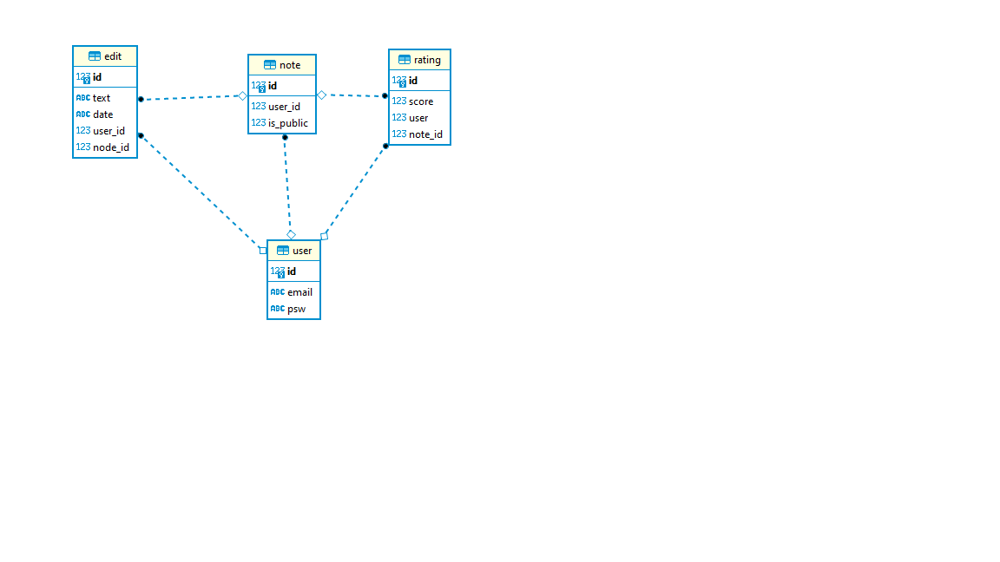

# Code-Spring-2022
My Webproject for code Spring 2022

A simple note taking application

Built using flask

To run all is needed is to clone this repository
make sure python is installed
run the app.py file and then visit the local host file from there

SECURITY checks in place

    Stateless cookie user authentication, using the flask_login module.
    Cookie auth was picked for this project as it is user friendly.

    There are several threats that can happen when using this method of auth, it does leave issues and risk of Cross-site Request Forgery(CSRF), this is when a malicious agent is able to take the stored data from a registered user by imitatiating what appears to be an http request from a legit site.

    Password hashing is done with sha256 method of hash

Vulnerabilities

    xss - currently the notes writing is not secured so a user writing and storing the notes in our database could launch an attack in which an attacker injects malicious executable scripts into the code of a trusted application or website.

    Brute force - Currently the password requirement is very small all is needed is that it has to be over 7 characters long, without more requirements it would be vulnerable to brute forcing as a malicious user could just try over and over and over every possible combination until they are logged in under another users account.

    User login email is not Anonymous - The website will give a warning if you attempt a login with an email that isnt in our database. So an attacker has access to seeing what emails are registered,

    Stateless auth - there is no way of logging a user out on the backend must wait for the user to log out on the front end or the session end on its own which may take time leaving it open for malicious agents.

    Cross-site Request Forgery(CSRF) -  a malicious agent is able to take the stored data from a registered user by imitatiating what appears to be an http request from a legit site.

DATABASE
